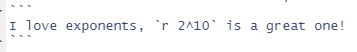
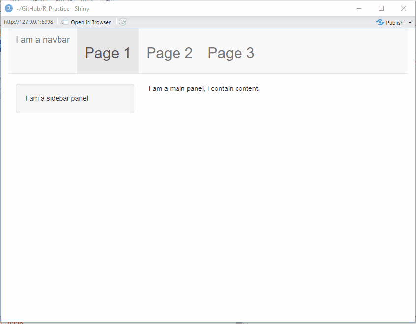

##### ***Chapter 1: Getting Started***
Install [RStudio](https://posit.co/downloads/) & [Git](https://gitforwindows.org/)

##### ***Chapter 2: Using the command line***
Get comfortable using the terminal for navigation using commands like: ls, cd, mkdir
[Reference](https://riptutorial.com/terminal/example/26023/basic-navigation-commands)

##### ***Chapter 3: Version Control***
A closer look at git/GitHub, make a repo, commit to it
Here's [My Github](https://github.com/Tomjohnsonellis)

##### ***Chapter 4: Using Markdown for Documentation***
All of the readmes for this project are made using markdown

##### ***Chapter 5: Introduction to R***

```{r}
print("Hello world!")

?function # Brings up helpful info
TRUE + FALSE # Booleans
```

##### ***Chapter 6: Functions***
```{r}
# Here's a function declaration
my_cool_function <- function(some_variable, another_variable){
  value_to_return <- some_variable + another_variable
  value_to_return # The value to be returned should be called as the last instruction
}

my_cool_function(10,5)

# Here is a function with a conditional statement
greet_user <- function(name){
  if (name == "Tom"){
    print("What is up, T-Dawg")
  } else {
    sprintf("Hello % s", name)
  }
}

greet_user("Tom")
greet_user("Joe Bloggs")
```

##### ***Chapter 7: Vectors***
A vector is a collection of data, like a list of numbers or names or dates of birth.
R is a popular data science language as the majority of functions and tools are built to work with vectorised data.
```{r}
a_vector <- c(1,2,3,4,5)
a_vector
a_vector * 2
```
This approach scales up very well for working with big databases! It's both easier to follow logically and more efficient in terms of computer processing!

##### ***Chapter 8: Lists***
Lists are essentially a vector that can hold multiple data types, useful for working with related data.
```{r}
some_employee <- list(
  forename = "Joe",
  surname = "Bloggs",
  job = "CEO",
  salary = 999999,
  union_member = TRUE
)

some_employee$surname
some_employee[2]
some_employee[["surname"]]
```

##### ***Chapter 9: Understanding Data***
A more general topic about the world of data, covers topics such as:

* Where data comes from:
  + Sensors
  + Surveys
  + Record keeping
* Where to find data:
  + Government publications (Big up the ONS)
  + Newspapers/Journalists
  + Scientific research
  + Social media
  + Online communities
* Different types of data:
  + Nominal (apples and oranges)
  + Ordinal (5 star rating, 4 star rating)
  + Ratio/Continuous (Ordered with a fixed 0)
  + Interval (Ordered but no fixed 0)

##### ***Chapter 10: Data Frames***
Data frames are one of the most common ways to work with data, any table is a data frame, an Excel spreadsheet is a data frame.
```{r}
name <- c("Alice","Bob","Chuckie","Dylan")
height <- c(100,150,175,75)
weight <- c(50,75,100,200)

my_dataframe <- data.frame(name, height, weight)
my_dataframe

```

##### ***Chapter 11: Manipulating data with dplyr***
dplyr is a very useful and popular package for wrangling data, it has a consistent "Grammar of data manipulation"
* *Select* specific features
* *Filter* out what you don't want
* *Mutate* a data set by creating new features
* *Arrange* observations in some way
* *Summarize* data in terms of aggregates (e.g. mean, median, range, max value)
* *Join* data sets together
```{r}
library(dplyr)
my_dataframe %>%
  filter(weight < 200) %>%
  mutate("BMI" = weight / (height/100)^2) %>%
  select(name, BMI)

```

##### ***Chapter 12: Reshaping Data with tidyr***
Tidy Data:
1. Each variable is in a column
2. Each observation is a row
3. Each value is a cell
```{r}
gather() # To make your data long
spread() # To make your data wide
```

##### ***Chapter 13: Accessing Databases***
A little intro into using SQL and some info about relational databases.
Relational databases are pretty much a necessity for working with more complex data structures, requiring information to be stored in different places for different reasons. An example would be a music library, it is much more scalable to have a big database of artists and a separate big database of songs, pulling the necessary data as needed rather than having it all in one huge mess.
R can be used to work with databases, like so:
```{r}
library("RSQLite") # An SQL package
library("dplyr") # Good ol' dplyr

# Connect to a database
database_connection <- dbConnect(SQLite(), dbname = "~/GitHub/R-Practice/Exercises/chapter-13/data/Chinook_Sqlite.sqlite")

# Have a look at the available tables
# dbListTables(database_connection)

# "collect" the info in a table and put it into a dataframe, our preferred thing to use
track_df <- collect(tbl(database_connection, "Track"))

# Have a look like normal!
#df$Name[1:5]

# Let's find all the songs of a particular genre
genre_df <- collect(tbl(database_connection, "Genre"))
# genre_df$Name # There's 25, I'll pick "Electronica/Dance"
# We need to use the "Artist ID" of this artist to find the songs they are credited with
id_to_use <- genre_df %>%
  filter(Name == "Electronica/Dance") %>%
  select(GenreId)

results <- track_df %>%
  filter(GenreId == id_to_use$GenreId) %>%
  arrange(-Milliseconds) %>% # Longest song to shortest song
  select(Name, Composer)

# Here's the 5 longest Electronic songs in the database
head(results, 5)
# They're alright, I listened to them while writing the next chapter of this recap!

# Finally, close the connection
dbDisconnect(database_connection)

```

##### ***Chapter 14: Accessing Web APIs***
APIs are a very useful tool to access data, it allows companies to share data in a secure way and allows developers to make specific data requests instead of downloading entire databases systems to their local machine and processing it from there!
API data can be a bit fiddly, as it may be in one of several different formats (commonly JSON or YAML) and will likely arrive as nested dataframes which can be difficult to keep track of.
```{r}
library("jsonlite")
# A typical request would look like this:
# GET some data
response <- GET(uri_of_the_data, query = my_query_parameters)
# Extract the CONTENT of the response you get
response_text <- content(response, "text")
# Turn the JSON data into a list
response_data <- fromJSON(response_text)
# You'll likely end up with a dataframe of columns which are also dataframes, messy!
# So FLATTEN it!
flatten(response_data)
```
Once you have the data in a usable form, it's business as usual.

##### ***Chapter 15: Designing Data Visualisations***
_"The purpose of visualisation is insight, not pictures"_
- Card, S.K., Mackinlay, J.D., & Shneiderman B. (1999)

As much as I like pretty graphs, they are in practice a means to an end, and that end is communicating insights in an efficient manner.

It is important to remember what you are trying to do with a graph,
What is the _specific_ question of interest you are attempting to answer?
What layout of data is most suitable for this?
What graphical encodings give the best perceptability to the data? (What colours show the best?)
Would a preattentive attribute work best? (Colour one point, use a different shape, draw a box around an area etc.)

To make beautiful charts, remove clutter, don't add design.

##### ***Chapter 16: Creating Visualisations with ggplot2***
```{r}
library("ggplot2")
x <- c(1,2,3,4,5,6,7,8,9,10)
y <- c(1,4,9,16,25,36,49,64,81,100)
df <- data.frame(x,y)

ggplot(data = df, aes(x,y)) +
  geom_line(color = "purple", linewidth=2) +
  geom_point(size = 5,shape = 16) +
  ggtitle("An ugly graph of square numbers") +
  scale_x_continuous(breaks = x)
```

There a bunch of different plotting styles and colour palettes and co-ordinate systems, each graph will require consideration on how best to display the data, then ggplot can be given the data and instructions to produce that graph.

##### ***Chapter 17: Interactive Visualisation in R***
There are a few packages that give you "interactive" graphs very easily!
plotly, rbokeh and leaflet are covered in the book.
In short: plotly and rbokeh are pretty similar, leaflet is good for maps.

##### ***Chapter 18: Dynamic Reports with R Markdown***
This whole recap was written in R markdown!
It can also do inline commands too, for example:`


becomes: I love exponents, `r 2^10` is a great one!

##### ***Chapter 19: Building Interactive Web Applications with Shiny***
This was a fun chapter, shiny allows you to build simple websites with code.
The layouts are created with different objects like titlePanel(), sidebarPanel() etc, then the content is rendered into a webpage!

It's considered best practice to split the website into separate files, a UI file, a server file, and an app.R file that brings them together.

```{r}
setwd("~/GitHub/R-Practice")
# app.R
source("shiny/my_ui_file.R") # Creates "my_ui"
source("shiny/my_server_file.R") # Creates "my_server"
shinyApp(ui = my_ui, server = my_server)

# This website may be ugly, but it does work!

```
Here's a demo of the website:

